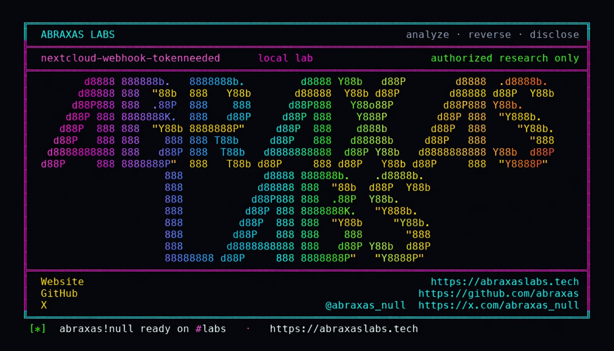

<p align="center">
  
</p>

<p align="center">
  <a href="https://abraxaslabs.tech"><strong>abraxaslabs.tech</strong></a>
  &nbsp;·&nbsp;
  <a href="https://github.com/abraxas">github.com/abraxas</a>
  &nbsp;·&nbsp;
  <a href="https://x.com/abraxas_null">@abraxas_null</a>
  &nbsp;·&nbsp;
  <a href="https://github.com/abraxas/nextcloud-webhook-tokenneeded">nextcloud-webhook-tokenneeded</a>
</p>

# nextcloud-webhook-tokenneeded

**Nextcloud Server** `35.0.0` - Nextcloud GmbH

`WebhooksController::create()` nulls `tokenNeeded` unless the caller is a full instance admin. `update()` does not. A delegated Webhooks settings admin (not in `admin`) can store `tokenNeeded.user_ids: ["admin"]` on an existing webhook, then receive a one-hour unscoped `PERMANENT_TOKEN` app password for that uid when the event fires.

**A bad actor who was only trusted to manage webhooks can log in as `admin` (or any user they name) for one hour, skip 2FA, and read or overwrite that person's files.**

| | |
|---|---|
| ID | no CVE yet |
| CWE | [CWE-863, CWE-269](https://cwe.mitre.org/data/definitions/863.html) |
| CVSS | **High: 8.8** `CVSS:3.1/AV:N/AC:L/PR:L/UI:N/S:U/C:H/I:H/A:H` |
| Product | [Nextcloud Server](https://github.com/nextcloud/server) |
| Affected | **35.0.0** (`da02f41`) official `nextcloud:35.0.0-apache` |
| Auth | delegated Webhooks settings admin (`IDelegatedSettings`) |
| License | [GNU Affero GPL v3.0](LICENSE) |
| Lab | `127.0.0.1` only |

---

## What an attacker can do

You gave someone the **Webhooks** settings job. They are not in the `admin` group. Nextcloud still lets them edit an existing webhook so that, on the next matching event, the server **mails them a one-hour login** for any uid they list, including `admin`.

With that login they can:

- Open **all of that person's files** (not only something the webhook was supposed to see)
- **Download and overwrite** those files
- Use Files / WebDAV **as that person**
- **Skip 2FA** (this is an app password, not a password prompt)

They do not need a PHP shell on the host. They do not need to be a full instance admin. A stranger on the internet with no account cannot do this. The hole is the staffer you already trusted with webhooks, impersonating the people you did not.

---

## How I found it

`WebhooksController` is `#[AuthorizedAdminSetting(settings: Admin::class)]`. `Admin` implements `IDelegatedSettings`. That is how Nextcloud hands a settings panel to a group that is not `admin`.

`tokenNeeded` asks the server to attach auth tokens for named uids when the webhook fires. `TokenService::createEphemeralToken` mints `IToken::PERMANENT_TOKEN` with `password = null`. App password. 2FA already behind you.

PR #60543 gated **create**: unless you are a full instance admin, `tokenNeeded` is nulled. I created a webhook as delegated user `hooker` with `tokenNeeded.user_ids: ["admin"]`. Stored `tokenNeeded` was `[]`. Create is gated. For a minute that looks like a finished patch.

Then I POSTed the same body to `/webhooks/{id}`. Stored `user_ids` was `['admin']`. `update()` never copied the `if`.

PUT a file as `hooker` so `NodeCreatedEvent` fires. Cron runs `WebhookCall`. Catcher JSON has `authentication.user_ids.admin.token`. Bearer GET of the admin private witness file returned **200**, `X-User-Id: admin`.

Ways this dies without teaching you anything: update 403 (controller already matches create); create already minting tokens (#60543 not on the build); empty `authentication` in the catcher (cron did not mint); ExApp header path (the lab user is delegated `hooker`).

---

## Lab

```bash
cd lab
./run.sh
```

Target **only** `http://127.0.0.1:18320` (Nextcloud) and `:18321` (catcher).

```text
SUCCESS NEXTCLOUD-WEBHOOK-TOKENNEEDED who=delegated-webhook-admin uid=admin NEXTCLOUD-WEBHOOK-TOKENNEEDED-WITNESS
```

- [`lab/docker-compose.yml`](lab/docker-compose.yml)
- [`lab/run.sh`](lab/run.sh)
- [`lab/hook/Dockerfile`](lab/hook/Dockerfile)

---

## The fix

Copy the create `isAdmin` null-out into `update()`. Until that ships, do not delegate Webhooks settings to non-admin groups.

---

## References

- [github.com/nextcloud/server](https://github.com/nextcloud/server) tag [v35.0.0](https://github.com/nextcloud/server/releases/tag/v35.0.0) (`da02f41`)
- Nearby create-only fix: [nextcloud/server#60543](https://github.com/nextcloud/server/pull/60543)
- Abraxas Labs: [abraxaslabs.tech](https://abraxaslabs.tech) · [github.com/abraxas](https://github.com/abraxas) · [@abraxas_null](https://x.com/abraxas_null)

---

## License

GNU Affero GPL v3.0. See [LICENSE](LICENSE). Loopback lab only. No warranty.
